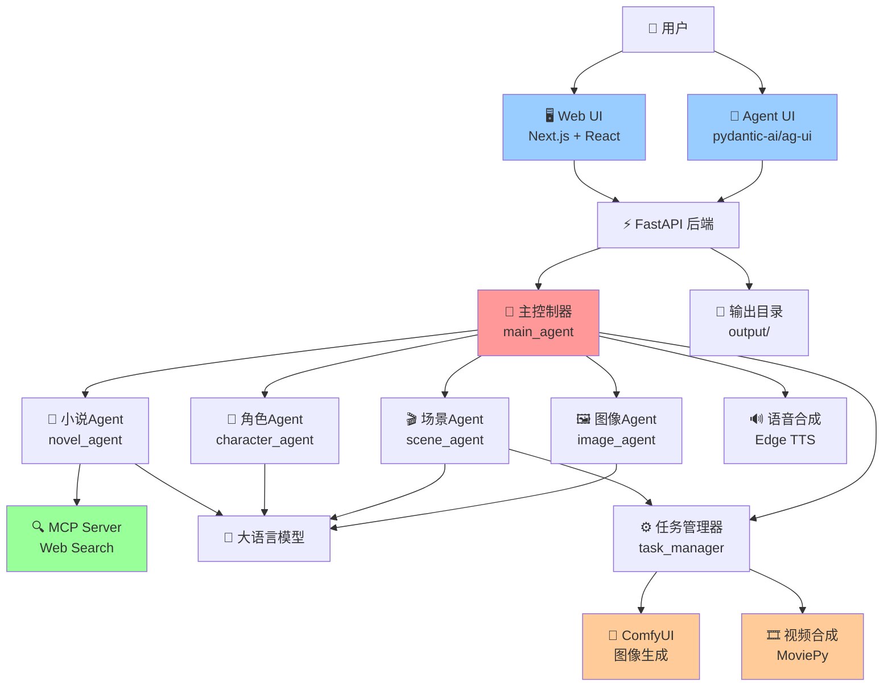
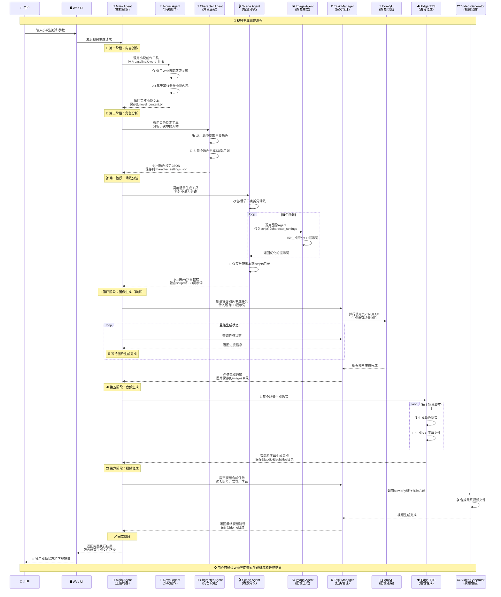
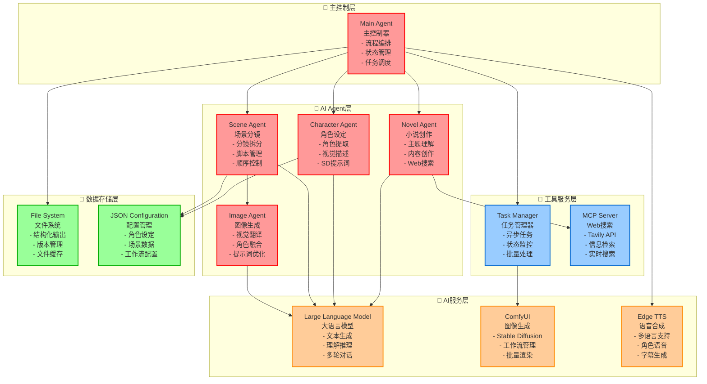
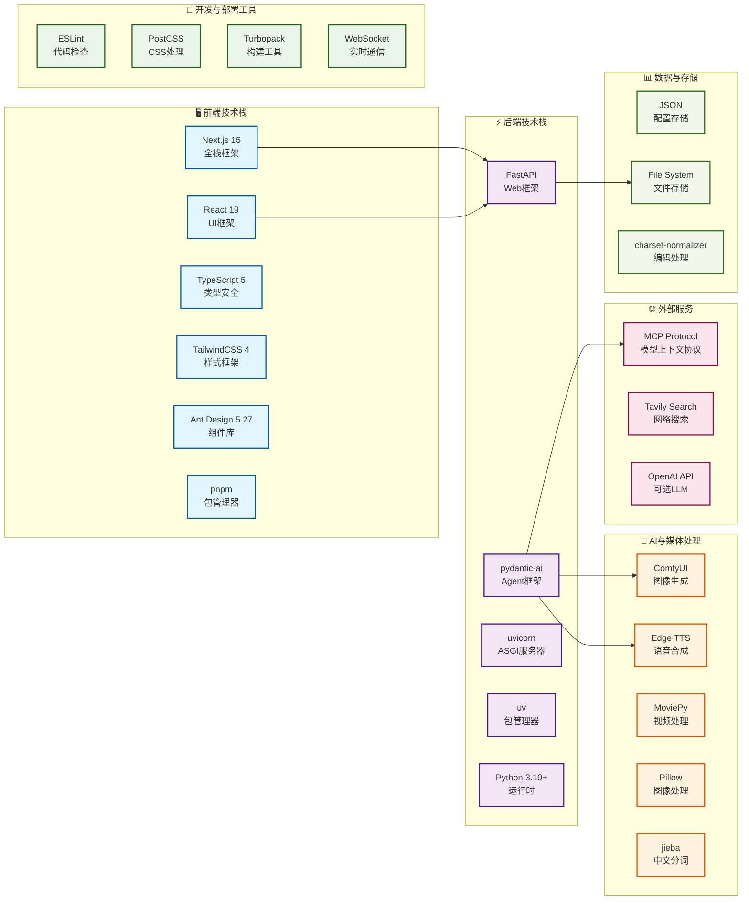

# 视频生成代理系统 (Video Generation Agent System)

[](https://www.python.org/downloads/)
[](https://fastapi.tiangolo.com/)
[](https://nextjs.org/)
[](LICENSE)

一个基于多Agent架构的AI视频生成系统，能够自动将小说文本转换为完整的短视频作品。

## 🚀 快速开始

### 环境要求

- uv
- Node.js 18+
- ComfyUI 服务器

### 安装

1. **克隆项目**
```bash
git clone https://github.com/tohsaka888/video-generate-agent.git
cd video-generate-agent
```

2. **安装Python依赖**
```bash
# 使用 uv (推荐)
uv sync

# 或使用 pip
pip install -r requirements.txt
```

3. **安装Web前端依赖**
```bash
cd web
pnpm install
# 或 npm install
```

4. **配置环境变量**
```bash
cp .env.example .env
# 编辑 .env 文件，配置必要的API密钥
```

环境变量说明：
- `COMFYUI_BASE_URL`: ComfyUI服务器地址
- `TAVILY_API`: Tavily搜索API密钥
- `OPENAI_API_KEY`: OpenAI API密钥（可选）
- `FONT_PATH`: 字体文件路径

### 运行

1. **启动后端服务**
```bash
# 开发模式
uv run main.py
```

2. **启动前端服务**
```bash
cd web
pnpm dev
# 或 npm run dev
```

3. **访问应用**
- Web界面: http://localhost:3000
- API文档: http://localhost:8000/docs
- Agent UI: http://localhost:8000/agent

## 📋 使用说明

### 基本流程

1. **访问Web界面** - 打开 http://localhost:3000
2. **输入小说基线** - 在输入框中描述您想要的小说主题或大纲
3. **开始生成** - 系统将自动执行以下步骤：
   - 🔸 小说创作 - AI根据基线创作完整小说
   - 🔸 角色设定 - 生成小说中的角色描述
   - 🔸 场景分镜 - 将小说分解为视频场景
   - 🔸 图片生成 - 为每个场景生成对应图像
   - 🔸 音频合成 - 生成旁白和背景音
   - 🔸 视频合成 - 合成最终视频作品

### API接口

- `POST /agent` - Agent交互接口
- `GET /api/output-tree` - 获取输出文件树
- `GET /api/file-tree` - 文件树状态（兼容接口）

## 🤖 AI Agent 详细介绍

### 主控制器 Agent (Main Agent)
**位置**: `agents/main_agent.py`  
**职责**: 系统的核心控制器，负责协调所有子Agent的工作流程

**主要功能**:
- 🎯 **流程编排**: 按照预定义的工作流程依次调用各个子Agent
- 📊 **状态管理**: 维护整个生成过程的状态信息
- 🔄 **任务调度**: 协调异步任务的执行和监控
- 📈 **进度追踪**: 实时更新任务进度并通知用户

**工作流程**:
1. 接收用户输入的小说基线
2. 调用小说Agent创建完整小说
3. 调用角色Agent生成人物设定
4. 调用场景Agent生成分镜场景
5. 批量提交图片生成任务（异步执行）
6. 监控图片生成状态直到完成
7. 生成对应的音频和字幕文件
8. 启动视频合成任务
9. 汇总结果并通知用户

### 小说创作 Agent (Novel Agent)
**位置**: `agents/novel_agent.py`  
**职责**: 专业的小说内容创作，根据用户提供的基线生成完整小说

**核心能力**:
- 📚 **主题理解**: 准确解析用户提供的小说基线和创作要求
- 🔍 **信息搜索**: 集成Web搜索工具，获取创作灵感和参考资料
- ✍️ **内容创作**: 生成结构完整、情感丰富的小说文本
- 📝 **文学功底**: 具备扎实的叙事结构、人物塑造和情节设计能力

**输入参数**:
- `baseline`: 用户提供的小说基线/主题
- `word_limit`: 字数限制要求

**输出**: 完整的小说文本内容，保存至 `output/novel_content.txt`

### 角色设定 Agent (Character Agent)
**位置**: `agents/character_agent.py`  
**职责**: 从小说中提取主要角色并生成详细的视觉描述

**专业技能**:
- 👥 **角色提取**: 从小说文本中识别所有主要人物
- 🎨 **视觉描述**: 为每个角色生成专业的Stable Diffusion提示词
- 🔍 **细节刻画**: 包含外观、服饰、年龄、性别等详细特征
- ⚖️ **权重优化**: 合理设置提示词权重以确保生成效果

**输出格式**:
```json
[
  {
    "name": "角色中文名",
    "character_setting": "专业英文SD提示词"
  }
]
```

**特色功能**:
- 🎯 **优先级排序**: 重要特征置于提示词前部以增加权重
- 🎭 **多样化描述**: 支持不同年龄段、性别、风格的角色设定
- 🎨 **权重控制**: 使用括号语法 `(feature:1.2)` 精确控制特征权重

### 场景分镜 Agent (Scene Agent)
**位置**: `agents/scene_agent.py`  
**职责**: 将小说内容拆分为适合视频制作的分镜场景

**核心功能**:
- 🎬 **分镜拆分**: 将完整小说按情节节点拆分为多个场景
- 📋 **脚本管理**: 确保每个分镜片段完整且符合原文
- 🔄 **顺序保持**: 严格按照原文顺序进行场景划分
- 🎯 **长度控制**: 每个场景控制在50-300字的合适长度

**技术要求**:
- ✅ **原文一致性**: 分镜内容必须与小说原文完全一致
- 🚫 **无重叠**: 确保场景之间不存在内容重叠
- 📏 **数量限制**: 最多生成10个分镜场景
- 📝 **格式规范**: 输出标准JSON数组格式

**协作流程**:
1. 读取小说内容进行智能分析
2. 按情节转折点划分场景
3. 调用图像Agent为每个场景生成SD提示词
4. 保存分镜脚本到 `output/scripts/` 目录

### 图像生成 Agent (Image Agent)
**位置**: `agents/image_agent.py`  
**职责**: 为每个分镜场景生成专业的Stable Diffusion图像提示词

**专业能力**:
- 🖼️ **视觉翻译**: 将文字场景转换为精确的视觉描述
- 👤 **角色融合**: 结合角色设定生成一致的人物形象
- 🎨 **艺术指导**: 优化提示词以获得最佳视觉效果
- 🌍 **场景构建**: 描述环境、光线、构图等视觉要素

**输入依赖**:
- `script`: 分镜脚本内容
- `character_settings`: 角色设定信息

**提示词优化技术**:
- 🔤 **英文表达**: 使用CLIP模型友好的英文短语
- ⚖️ **权重设置**: 通过 `(keyword:1.5)` 语法控制重要程度
- 📊 **优先级排序**: 重要元素前置以获得更好效果
- 🎯 **精准描述**: 涵盖构图、光线、风格、情感等多维度信息

## 🏗️ 架构设计

### 系统架构图



### 多Agent交互流程



### AI Agent架构组件



### 技术栈组件



## 📁 项目结构

```
video-generate-agent/
├── 📄 main.py                 # FastAPI主应用入口
├── 📄 pyproject.toml          # Python项目配置(uv包管理)
├── 📁 agents/                 # 🤖 AI Agent核心模块
│   ├── 📄 __init__.py         # Agent包初始化
│   ├── 📄 main_agent.py       # 🎯 主控制器Agent - 协调整个工作流程
│   ├── 📄 novel_agent.py      # 📖 小说创作Agent - 内容创作与Web搜索
│   ├── 📄 character_agent.py  # 👥 角色设定Agent - 角色提取与视觉描述
│   ├── 📄 scene_agent.py      # 🎬 场景分镜Agent - 情节拆分与脚本管理
│   └── 📄 image_agent.py      # 🖼️ 图像生成Agent - SD提示词优化
├── 📁 mcp_servers/            # 🔍 MCP服务器模块
│   ├── 📄 __init__.py         # MCP包初始化
│   └── 📄 web_search.py       # 🌐 网络搜索工具(Tavily API)
├── 📁 utils/                  # 🛠️ 核心工具模块
│   ├── 📄 llm.py             # 🧠 大语言模型接口封装
│   ├── 📄 comfyui.py         # 🎨 ComfyUI API客户端
│   ├── 📄 edge_tts.py        # 🔊 Edge TTS语音合成
│   ├── 📄 video.py           # 🎞️ MoviePy视频处理
│   ├── 📄 task_manager.py    # ⚙️ 异步任务管理器
│   ├── 📄 config.py          # ⚙️ 系统配置管理
│   ├── 📄 output_tree.py     # 📁 输出目录树结构
│   └── 📄 scene.py           # 🎬 场景数据处理
├── 📁 web/                   # 🖥️ Next.js前端应用
│   ├── 📄 package.json       # 前端依赖配置(pnpm)
│   ├── 📄 next.config.ts     # Next.js构建配置
│   ├── 📄 tsconfig.json      # TypeScript配置
│   ├── 📁 app/               # Next.js 15应用路由
│   │   ├── 📄 layout.tsx     # 全局布局组件
│   │   ├── 📄 page.tsx       # 主页面组件
│   │   └── 📁 api/           # API路由处理
│   └── 📁 components/        # React UI组件库
├── 📁 assets/                # 📦 静态资源文件
│   ├── 📁 bgm/              # 🎵 背景音乐库(MP3格式)
│   ├── 📁 font/             # 🔤 字体文件(支持中文渲染)
│   ├── 📁 voice/            # 🎙️ 语音模板(男/女/旁白)
│   ├── 📁 novel/            # 📚 示例小说内容
│   └── 📁 workflow/         # ⚙️ ComfyUI工作流配置
├── 📁 output/               # 📤 AI生成输出目录
│   ├── 📄 novel_content.txt  # 📖 生成的小说文本
│   ├── � character_settings.json # 👥 角色设定JSON
│   ├── 📄 scenes.json       # 🎬 场景分镜数据
│   ├── �📁 images/           # 🖼️ AI生成的场景图片
│   ├── 📁 audio/            # 🔊 TTS生成的音频文件
│   ├── 📁 scripts/          # 📝 分镜脚本文件
│   ├── 📁 subtitles/        # 📝 SRT字幕文件
│   └── 📄 final_video.mp4   # 🎬 最终合成视频
├── 📁 demo/                 # 🎬 示例输出目录
│   └── 📄 final_video.mp4   # 完整的示例视频作品
├── 📁 scripts/              # 📜 自动化脚本
│   └── 📄 update.sh         # 项目更新脚本
└── 📁 __pycache__/          # Python字节码缓存
```

## 🔧 配置说明

### Agent配置

各个AI Agent都可以通过以下方式进行个性化配置：

#### 🎯 主控制器Agent配置
- **工作流程控制**: 可自定义Agent调用顺序
- **状态管理**: 配置进度跟踪和错误处理
- **并发控制**: 设置最大并发任务数量

#### 📖 小说Agent配置
- **字数限制**: 默认1000字，可根据需求调整
- **创作风格**: 支持不同文学风格设定
- **搜索深度**: 配置Web搜索的深度和范围

#### 👥 角色Agent配置
- **提取精度**: 设置角色识别的敏感度
- **描述详细度**: 控制角色描述的详细程度
- **权重优化**: 自定义SD提示词权重策略

#### 🎬 场景Agent配置
- **分镜数量**: 最多10个场景，可根据内容调整
- **场景长度**: 50-300字范围内的灵活控制
- **拆分算法**: 支持不同的场景划分策略

#### 🖼️ 图像Agent配置
- **提示词模板**: 可自定义SD提示词模板
- **艺术风格**: 支持多种艺术风格预设
- **图像质量**: 配置生成图像的分辨率和质量

### ComfyUI配置

确保ComfyUI服务器运行在指定端口，并配置工作流文件：

```json
{
  "workflow": "assets/workflow/config.json",
  "models": {
    "checkpoint": "您的SD模型路径",
    "vae": "VAE模型路径",
    "lora": "LoRA模型路径"
  },
  "settings": {
    "batch_size": 4,
    "steps": 20,
    "cfg_scale": 7.0,
    "width": 512,
    "height": 768
  }
}
```

### LLM模型配置

支持多种大语言模型：

```python
# utils/llm.py 配置示例
LLM_CONFIG = {
    "model_name": "gpt-4o-mini",  # 或其他兼容模型
    "api_key": "your-api-key",
    "base_url": "https://api.openai.com/v1",
    "temperature": 0.7,
    "max_tokens": 4000
}
```

### 环境变量配置

创建 `.env` 文件并配置以下变量：

```bash
# ComfyUI服务配置
COMFYUI_BASE_URL=http://localhost:8188

# 搜索服务配置
TAVILY_API=your-tavily-api-key

# LLM服务配置（可选）
OPENAI_API_KEY=your-openai-api-key
OPENAI_BASE_URL=https://api.openai.com/v1

# 文件路径配置
FONT_PATH=assets/font/MapleMono-NF-CN-Regular.ttf
BGM_PATH=assets/bgm/
VOICE_PATH=assets/voice/

# Agent行为配置
MAX_SCENES=10
DEFAULT_WORD_LIMIT=1000
CONCURRENT_TASKS=4
```

### 字体配置

系统支持自定义字体，默认使用：
- `assets/font/MapleMono-NF-CN-Regular.ttf`

### 背景音乐

将背景音乐文件放置在 `assets/bgm/` 目录下，支持格式：
- MP3, WAV, OGG, M4A

## 🚧 故障排除

### Agent相关问题

#### 🎯 主控制器Agent问题
1. **Agent调用超时**
   - 检查各子Agent的响应时间
   - 适当增加超时配置
   - 监控系统资源使用情况

2. **状态同步异常**
   - 清除缓存目录：`rm -rf .cache/`
   - 重启Agent服务
   - 检查状态存储权限

#### 📖 小说Agent问题
1. **内容生成质量差**
   - 优化输入的baseline描述
   - 调整word_limit参数
   - 检查LLM模型配置

2. **Web搜索失败**
   - 验证Tavily API密钥有效性
   - 检查网络连接状态
   - 确认MCP服务器运行状态

#### 👥 角色Agent问题
1. **角色提取不准确**
   - 确保小说内容足够详细
   - 调整角色识别算法参数
   - 手动检查novel_content.txt

2. **SD提示词效果差**
   - 优化character_settings.json格式
   - 调整权重设置策略
   - 验证英文描述准确性

#### 🎬 场景Agent问题
1. **分镜拆分不合理**
   - 检查小说结构完整性
   - 调整场景长度限制
   - 优化分镜算法参数

2. **场景数量异常**
   - 确认MAX_SCENES环境变量
   - 检查scripts目录权限
   - 验证JSON输出格式

#### 🖼️ 图像Agent问题
1. **提示词生成失败**
   - 检查角色设定文件格式
   - 验证场景脚本内容
   - 确认LLM模型可用性

2. **图像风格不一致**
   - 统一提示词模板
   - 优化权重分配策略
   - 检查ComfyUI模型配置

### 系统级问题

#### 常见问题

1. **ComfyUI连接失败**
   - 检查 `COMFYUI_BASE_URL` 环境变量
   - 确保ComfyUI服务器正常运行
   - 验证网络端口可访问性

2. **图片生成失败**
   - 检查ComfyUI工作流配置
   - 验证模型文件是否正确加载
   - 确认显存和内存充足

3. **音频生成问题**
   - 确认Edge TTS服务可用
   - 检查网络连接状态
   - 验证语音角色配置

4. **视频合成错误**
   - 确保所有输入文件存在
   - 检查输出目录权限
   - 验证MoviePy依赖安装

5. **Agent通信异常**
   - 重启FastAPI服务
   - 清理Agent状态缓存
   - 检查Agent依赖完整性

### 性能优化

#### Agent性能调优
- **并发控制**: 合理设置CONCURRENT_TASKS数量
- **内存管理**: 定期清理临时文件和缓存
- **模型优化**: 选择合适的LLM模型规模
- **批处理**: 优化图像生成的批处理大小

#### 系统监控
```bash
# 查看Agent运行状态
curl http://localhost:8000/agent/status

# 监控任务队列
curl http://localhost:8000/api/task-status

# 检查输出目录
curl http://localhost:8000/api/output-tree
```

### 日志查看

- 后端日志：控制台输出
- 前端日志：浏览器开发者工具
- 任务状态：通过API接口查看

## 📄 许可证

本项目基于 MIT 许可证开源 - 查看 [LICENSE](LICENSE) 文件了解详情。

## 🔗 相关链接

- [FastAPI 文档](https://fastapi.tiangolo.com/)
- [pydantic-ai 文档](https://ai.pydantic.dev/)
- [ComfyUI 项目](https://github.com/comfyanonymous/ComfyUI)
- [Next.js 文档](https://nextjs.org/docs)

---

⭐ 如果这个项目对您有帮助，请给我们一个星标！
